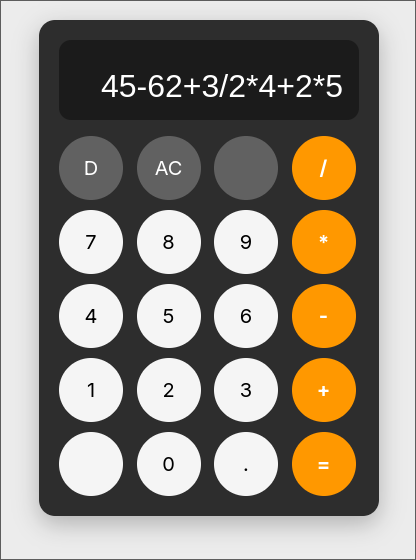

# Sezzle Interview FullStack Calculator

**Author**: Luis David Fuentes Juvera

## Overview

This project contains a full-stack calculator application with a React + TypeScript frontend and a Go REST API microservice that evaluates algebraic expressions. The application is based on Abstract Syntax Trees (ASTs), which are used to construct arbitrarily complex algebraic expressions and serialize them as JSON for transmission to the API microservice.

The implementation uses recursive data structures that are well suited for extensibility, maintainability, and correctness. This design also makes the expression format easy to audit and extend with additional operators or expression types.



## Architecture

The project is organized as a monorepo containing separate `./frontend` and `./backend` directories.

```text
./frontend
    /src
        /components -> UI components
        /hooks      -> Global calculator state
        /types      -> AST definitions, tokens, and supported operations
        /parser     -> Expression tokenization and AST construction
        /services   -> API client for the POST /solve endpoint
        index.css   -> Global styles
        App.tsx     -> Application entry point
    Dockerfile
```

```text
./backend
    /src
        /server/main.go -> Application entry point
    /internal
        /ast        -> Core AST parsing and evaluation logic
        /transport  -> HTTP handlers and JSON serialization/deserialization
        /middleware -> CORS middleware
        /server     -> HTTP server initialization
    Dockerfile
```

## Setup and Running

The project is designed to be run using Docker Compose through the `docker-compose.yaml` file. This file exposes the primary configuration variables.

Backend:

* `SERVER_PORT`
* `ALLOWED_ORIGINS`

Frontend:

* `VITE_SERVER_API_URL`

By default:

* The API is available at `http://localhost:8080`.
* The frontend application is available at `http://localhost:80`.

To build and start the containers:

```sh
docker compose up --build
```

To start the existing containers without rebuilding:

```sh
docker compose up
```

## API Example

The REST API microservice is exposed on port `8080` and provides the following endpoint:

`POST /solve`

The request body consists of an AST-like JSON object representing an arithmetic expression. The structure is recursive and easily extensible. The currently supported expression types are `BinaryExpr` and `Literal`.

For example, the expression `23.5 + 12.5 * 2.5` is represented as:

```json
{
    "type": "BinaryExpr",
    "op": "+",
    "left": {
        "type": "Literal",
        "val": 23.5
    },
    "right": {
        "type": "BinaryExpr",
        "op": "*",
        "left": {
            "type": "Literal",
            "val": 12.5
        },
        "right": {
            "type": "Literal",
            "val": 2.5
        }
    }
}
```

Any algebraic expression can be represented using this recursive structure. More sophisticated expressions can be supported by introducing additional expression types. For example, unary operators (such as `%`) could be represented by defining a `UnaryExpr` type containing a single child expression. Likewise, the set of supported operations can be extended beyond the current operators (`+`, `-`, `*`, `/`), while preserving the conventional rules of operator precedence.

The abstract definitions for the currently supported expression types are shown below:

```typescript
{
    type:   "BinaryExpr",
    op:     Operation,
    left:   Expr,
    right:  Expr
}

{
    type:   "Literal",
    val:    number
}
```

## Tests

The repository includes a basic set of unit tests covering the project's core logic.

The backend tests cover the `backend/internal/ast` and `backend/internal/transport` packages. To run them, ensure that Go is installed, then execute:

```sh
cd backend
go test ./...
```

The frontend includes tests for the token parser, AST construction, and a mocked `solveApi` service. To run them:

```sh
cd frontend
npm install
npm run test
```

## Trade-offs

The project currently supports only the four basic arithmetic operations: `+`, `-`, `*`, and `/`.

The optional operators `^` (exponentiation) and `%` (percentage) were intentionally omitted because they introduce additional complexity. The exponentiation operator is right-associative, while the percentage operator is unary. Supporting these operators would require extending the AST construction algorithm in the frontend and adding the corresponding node evaluation logic in the backend. Likewise, support for parentheses would require additional changes to the parsing algorithm.

The backend can also be further hardened by introducing request timeouts to protect against expensive computations. Additionally, a maximum expression depth or AST nesting limit could be enforced to prevent excessively complex expressions from consuming excessive resources.

## General

**Time Spent:** 5 hours

**Use of AI:** Claude was used throughout the project to help design the AST construction algorithm, generate portions of the unit tests for both the frontend and backend, improve the documentation, and answer language-specific syntax questions.

**Example Prompts**

* `Proofread the following REST API documentation: ...`
* `Guide me through implementing a Shunting Yard algorithm for building an AST from a token stream.`
* `How do I copy files from a builder container to a runtime container in Docker?`
* `Create a Dockerfile for building a Go microservice and package it in a scratch runtime container.`
* `I have the following AST parsing and evaluation logic. Help me write basic unit tests for the supported operations and nested expressions.`
